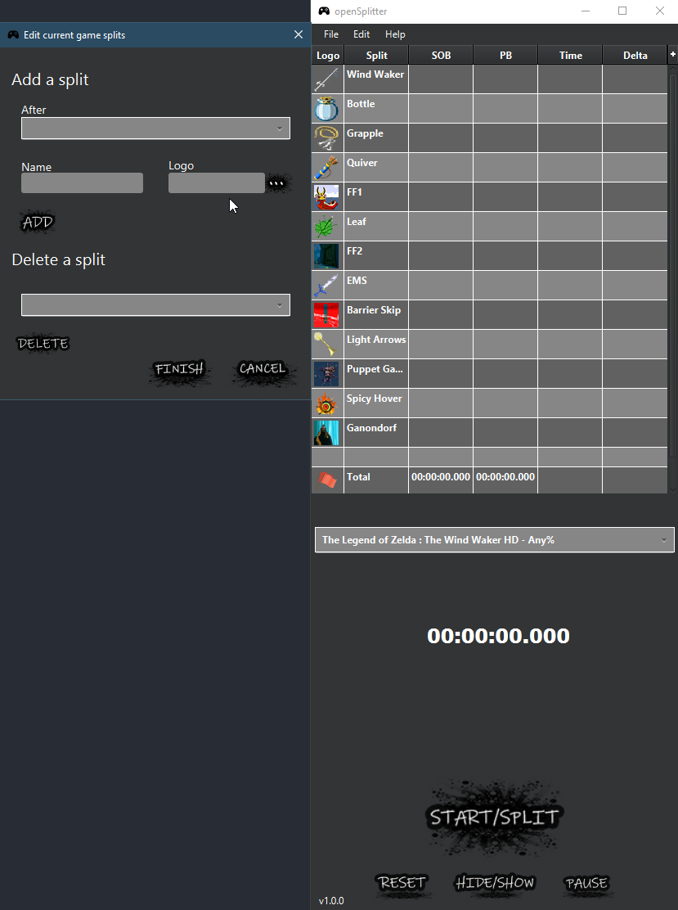

# openSplitter
## Purpose
openSplitter is an open source and cross platform livesplit like program coded in java.
You'll probably better use [Livesplit](https://livesplit.org/) excepting if you don't have windows and working internet connection.
## Installation

Download [JavaFX15+ SDK](https://gluonhq.com/products/javafx/) and put downloaded jars file inside the ./lib/javafx_jar folder.  
Download [Json.Simple](https://cliftonlabs.github.io/json-simple/) 3.1.1 jar file and put it in ./lib/simplejson_jar folder.  
Download and install [Open JDK](https://jdk.java.net/) 14 or more. 

## Start

Open the system corresponding file with a text editor. "launch.bat" for windows or "launch.sh" for linux & macosx.  
Replace the first path "/path/to/jdk/14+/java" with your jdk installation path.  
Launch the .bat or .sh using a command line.  

## Preview
  
You can edit colors modifying .css stylesheet in src/view.